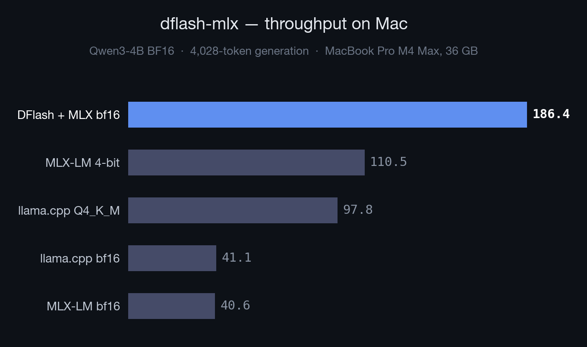

# dflash-mlx

Lossless DFlash speculative decoding for Apple Silicon. Same target-model output, fewer target forward passes, higher local throughput.

https://github.com/user-attachments/assets/13411079-7ffd-4f3f-a3cd-fdf3dd44a537

[DFlash](https://arxiv.org/abs/2602.06036) uses a lightweight block diffusion model to draft multiple tokens in parallel. `dflash-mlx` ports the draft/verify loop to MLX so the target model verifies each block locally on Mac.

## Supported Models

| Target Model | Draft Model | Status |
|---|---|---|
| `mlx-community/Qwen3.5-4B-MLX-4bit` | `z-lab/Qwen3.5-4B-DFlash` | Stable |
| `mlx-community/Qwen3.5-4B-MLX-bf16` | `z-lab/Qwen3.5-4B-DFlash` | Stable |
| `mlx-community/Qwen3-4B-{bf16,8bit,4bit}` | `z-lab/Qwen3-4B-DFlash-b16` | Experimental |

Upstream DFlash checkpoints exist for Llama 3.1, Qwen3 Coder, Kimi-K2.5, and more in the [Hugging Face collection](https://huggingface.co/collections/z-lab/dflash).

## Installation

```bash
git clone https://github.com/aryagm/dflash-mlx.git
cd dflash-mlx
uv sync
```

## Quick Start

```bash
uv run dflash-mlx \
  --target-model mlx-community/Qwen3.5-4B-MLX-4bit \
  --draft-model z-lab/Qwen3.5-4B-DFlash \
  --max-new-tokens 128
```

Plain MLX-LM baseline:

```bash
uv run dflash-mlx-bench \
  --model mlx-community/Qwen3.5-4B-MLX-4bit \
  --prompt-file prompts/functional_equation.txt \
  --max-new-tokens 128 \
  --warmup-prompts 0
```

## Benchmarks

**Qwen3.5-4B bf16** on MacBook Pro M4 Max, 36 GB

| | tok/s | vs llama.cpp |
|---|---:|---:|
| llama.cpp | 35.6 | 1.0x |
| MLX-LM | 40.6 | 1.1x |
| **DFlash + MLX** | **100.5** | **2.8x** |

**Qwen3.5-4B 4-bit** on MacBook Pro M4 Max, 36 GB

| | tok/s | vs llama.cpp |
|---|---:|---:|
| llama.cpp (Q4_K_M) | 76.4 | 1.0x |
| MLX-LM | 119.4 | 1.6x |
| **DFlash + MLX** | **161.9** | **2.1x** |



BF16 is the cleanest exact speedup story. 4-bit is the fastest absolute throughput story. Absolute numbers vary by chip; the speedup ratios are the useful comparison.

`benchmarks/metrics_history.csv` tracks command-generated benchmark runs and metadata. `generation_tps` excludes prefill; `end_to_end_tps` includes prefill. The default verifier modes are lossless. `--verify-mode accept-all` is only a raw speed probe and is not a quality or exactness benchmark.

## Contributing

Use `uv` for setup and checks:

```bash
uv sync
uv run python -m py_compile dflash_mlx/*.py
```

New model families need an adapter in `dflash_mlx/adapters.py`.

## Citation

```bibtex
@article{chen2026dflash,
  title   = {DFlash: Block Diffusion for Flash Speculative Decoding},
  author  = {Chen, Jian and Liang, Yesheng and Liu, Zhijian},
  journal = {arXiv preprint arXiv:2602.06036},
  year    = {2026}
}
```

## License

MIT
