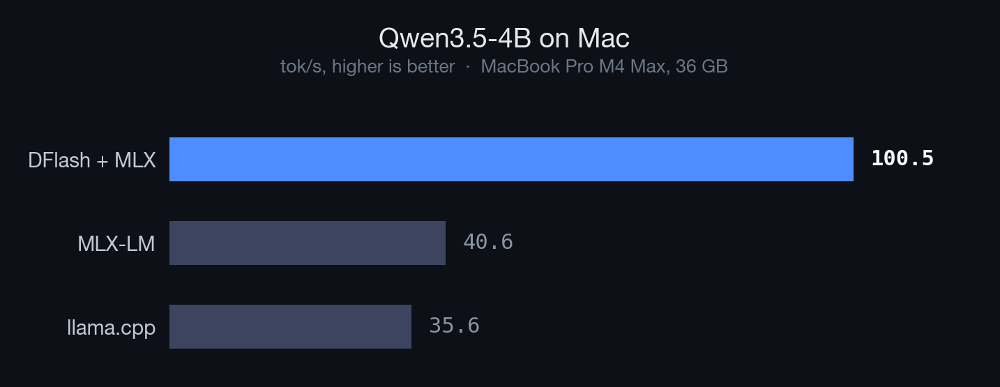

# dflash-mlx

Exact speculative decoding on Apple Silicon, powered by MLX.

https://github.com/user-attachments/assets/fee66404-9d56-4417-82e8-674ee9d4e483


DFlash uses a block-diffusion draft model to accelerate LLM inference. This project is a **native MLX runtime** that brings DFlash to Apple Silicon: output is identical to running the target model alone.

**Qwen3.5-4B**

| Framework | Qwen3.5-4B tok/s | Speedup |
|---|---:|---:|
| llama.cpp | 35.6 | 1.0x |
| MLX-LM | 40.6 | 1.1x |
| **DFlash + MLX** | **100.5** | **2.8x** |



**4-bit quantized**

| Framework | Qwen3.5-4B tok/s | Speedup |
|---|---:|---:|
| llama.cpp (Q4_K_M) | 76.4 | 1.0x |
| MLX-LM | 119.4 | 1.6x |
| **DFlash + MLX** | **161.9** | **2.1x** |

> Measured on a MacBook Pro M4 Max (36 GB). Absolute numbers vary by chip: the gains are what matter.

## What The Speedups Mean

The Qwen3.5-4B DFlash checkpoint is a **b16 draft**: it is trained to propose a
16-token block. The upstream model card reports up to **3.7x** exact speedup for
Qwen3.5-4B on NVIDIA B200 with SGLang/vLLM and FlashAttention. The larger
Qwen3-8B b16 checkpoint reports higher exact speedups, but that is a different
target model, a larger 1B drafter, and a CUDA serving stack.

For the 4B Mac path, exact DFlash should be evaluated against the same target
model and precision. Oversized blocks can show raw throughput, but they do not
represent lossless speculative decoding.

## Raw Speed Mode

There is also an **experimental, inexact** verifier path for speed research:

```bash
python3 scripts/run_dflash_mlx.py \
  --target-model mlx-community/Qwen3.5-4B-MLX-4bit \
  --verify-mode accept-all \
  --speculative-tokens 512 \
  --max-new-tokens 1024 \
  --warmup-runs 1
```

This trusts oversized DFlash draft blocks instead of checking the accepted prefix. It is not lossless and should not be used as a quality benchmark, but it shows the hardware ceiling: **998 tok/s generation, 895 tok/s end-to-end** on the same M4 Max run, about **8.4x faster than plain 4-bit MLX** in our logs.

You can verify why this is not exact with:

```bash
python3 scripts/diagnose_dflash_acceptance.py \
  --target-model mlx-community/Qwen3.5-4B-MLX-4bit \
  --draft-model z-lab/Qwen3.5-4B-DFlash \
  --speculative-tokens 512
```

On the functional-equation prompt, the forced 512-token block accepted only the
first input token before mismatch. That means the first drafted suffix token was
already not the target model's next token, so exact speculative decoding must
stop and resynchronize instead of accepting the remaining 511 drafted tokens.

## Quick Start

```bash
git clone https://github.com/aryagm/dflash-mlx.git
cd dflash-mlx
python3 -m venv .venv && source .venv/bin/activate
pip install -e . && pip install mlx mlx-lm

python3 scripts/run_dflash_mlx.py \
  --target-model mlx-community/Qwen3.5-4B-MLX-4bit \
  --draft-model z-lab/Qwen3.5-4B-DFlash \
  --max-new-tokens 128
```

## What We Built

The upstream [DFlash paper](https://arxiv.org/abs/2602.06036) targets CUDA. Getting speculative decoding to work well on Apple Silicon required solving several problems that don't exist on CUDA:

- **MLX speculative decoding loop**: MLX has no built-in speculative decoding. We wrote a full draft-then-verify loop that handles proposal generation, batched verification, and token acceptance in pure MLX, keeping everything on the Metal GPU.
- **Hidden state extraction**: DFlash's draft model needs intermediate hidden states from the target model, not just logits. We patched the MLX model forward pass to expose these without breaking the existing inference path or KV cache.
- **KV cache rollback**: when the target rejects a proposed token, the KV cache has to be rolled back to the last accepted position. Qwen3.5's hybrid sliding-window + global attention cache makes this non-trivial: each layer type needs different rollback logic.
- **Model-family adapter system**: different model architectures (Qwen, Llama, etc.) wire up hidden states and caches differently. The runtime uses a pluggable adapter layer so adding a new model family doesn't require touching the core decode loop.
- **Draft model quantization**: the draft model can be quantized independently of the target via `--draft-quant-bits`. In practice, on our Qwen3.5-4B path it hurt more than it helped: unquantized draft hits 161 tok/s, 8-bit drops to 155, and 4-bit to 140. The overhead of lower acceptance rates outweighs the memory savings. Still, for larger models or tighter memory budgets it may be worth exploring.

## Supported Models

| Target Model | Draft Model | Status |
|---|---|---|
| `mlx-community/Qwen3.5-4B-MLX-4bit` | `z-lab/Qwen3.5-4B-DFlash` | Stable |
| `mlx-community/Qwen3.5-4B-MLX-bf16` | `z-lab/Qwen3.5-4B-DFlash` | Stable |
| `mlx-community/Qwen3-4B-8bit` | `z-lab/Qwen3-4B-DFlash-b16` | Experimental |
| `mlx-community/Qwen3-4B-4bit` | `z-lab/Qwen3-4B-DFlash-b16` | Experimental |
| `mlx-community/Qwen3-4B-bf16` | `z-lab/Qwen3-4B-DFlash-b16` | Experimental |

Upstream DFlash checkpoints exist for Llama 3.1, Qwen3 Coder, Kimi-K2.5, and more: see the [HuggingFace collection](https://huggingface.co/collections/z-lab/dflash). Adding MLX adapter support for new families is a straightforward contribution.

## Benchmarking

```bash
# DFlash
python3 scripts/run_dflash_mlx.py \
  --target-model mlx-community/Qwen3.5-4B-MLX-4bit \
  --max-new-tokens 128 --warmup-runs 1

# Plain MLX baseline
python3 scripts/benchmark_mlx.py
```

Results are logged to [`benchmarks/metrics_history.csv`](benchmarks/metrics_history.csv) with full reproducibility metadata (git commit, hardware, prompt hash).

## Project Structure

```
scripts/
  run_dflash_mlx.py          # CLI for inference and benchmarking
  mlx_dflash_runtime.py      # Core speculative decoding loop
  mlx_dflash_draft.py        # DFlash draft model (MLX)
  mlx_dflash_adapters.py     # Model-family adapters (hidden state hooks, cache rollback)
  benchmark_mlx.py           # Plain MLX baseline benchmark
  diagnose_dflash_acceptance.py # Inspect exact acceptance for one draft block
  generate_benchmark_chart.py # Regenerate the chart above
  generate_qwen_comparison_chart.py # Regenerate the Qwen comparison chart
benchmarks/
  metrics_history.csv         # Tracked benchmark history
dflash/                       # Upstream DFlash package (CUDA path)
```

## Roadmap

- [ ] **More model families**: Llama 3.1, Qwen3-Coder, and other upstream DFlash checkpoints
- [ ] **Streaming API**: yield tokens as they're accepted for real-time applications
- [ ] **Longer contexts**: optimize for 4K+ token generation
- [ ] **Python library interface**: importable `dflash.generate()` beyond the CLI
- [ ] **Metal kernel optimizations**: custom kernels for the verify step
- [ ] **Hardware comparison matrix**: M1/M2/M3/M4 Pro/Max/Ultra benchmarks

## Contributing

The highest-impact areas:

1. **New model adapters**: each family needs an adapter in `scripts/mlx_dflash_adapters.py`. The Qwen3.5 adapter is a good reference.
2. **Benchmark results**: run on your Mac and open a PR with results.
3. **Bug reports**: issues with specific hardware or model configs.

## Citation

```bibtex
@article{chen2026dflash,
  title   = {DFlash: Block Diffusion for Flash Speculative Decoding},
  author  = {Chen, Jian and Liang, Yesheng and Liu, Zhijian},
  journal = {arXiv preprint arXiv:2602.06036},
  year    = {2026}
}
```

## License

MIT
