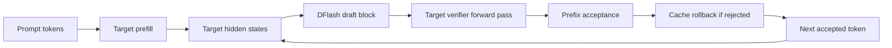

# Architecture

`dflash-mlx` is an exact speculative decoding runtime. The DFlash draft model proposes a block of tokens, but the target model remains the source of truth.

## Decode Loop

1. **Target prefill**: run the target model on the prompt and build the target KV/cache state.
2. **Hidden-state extraction**: collect the target layer features expected by the DFlash draft checkpoint.
3. **Draft block**: run the lightweight DFlash drafter to propose a block of candidate tokens in parallel.
4. **Verifier forward pass**: run the target model over the candidate block and compute the target model's posterior next tokens.
5. **Prefix acceptance**: accept only the longest drafted prefix that exactly matches the target model's posterior tokens.
6. **Cache rollback**: if the verifier rejects a suffix, rewind target KV caches and restore/rollback Qwen3.5 linear caches to the last accepted position.
7. **Resynchronize**: append the target posterior token and continue from the verified state.

## Exactness Boundary

The default verifier modes are lossless because accepted tokens are target-verified. If a drafted token differs from the target model's next token, DFlash stops at that point, rolls back rejected cache state, and resumes from the target token.

`--verify-mode accept-all` skips this prefix check. It is useful only for raw throughput experiments and must not be described as exact DFlash.

## Main Modules

- `dflash_mlx/runtime.py`: draft/verify loop, prefix acceptance, metric accounting.
- `dflash_mlx/adapters.py`: model-family adapters for prompts, hidden states, logits, and cache rollback.
- `dflash_mlx/draft.py`: MLX implementation of the DFlash draft model.
- `dflash_mlx/custom_qwen35_model.py`: local MLX model hook for Qwen3.5 hidden-state and cache support.
- `dflash_mlx/cli.py`: `uv run dflash-mlx`.
- `dflash_mlx/benchmark_cli.py`: `uv run dflash-mlx-bench`.
